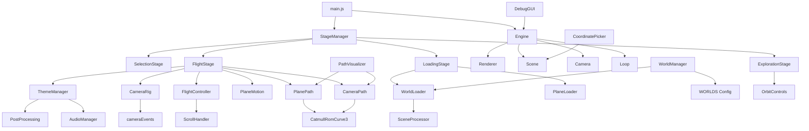

## Product Overview

Flight World Engine — 滚动驱动的电影级3D探索平台。纸飞机穿越由GLB文件加载的沉浸式3D世界，以环境叙事和场景探索为核心。无文字叠加、无叙述字幕、无UI干扰。

## Core Features

- **四阶段体验**：飞机选择 → 场景加载 → 电影级飞行旅程 → 自由探索模式
- **配置驱动多世界系统**：每个世界通过WORLDS配置数组定义，引擎无世界特定逻辑，支持无限世界
- **飞机选择与Cargo预留**：可选飞机（GLB模型），架构预留Cargo挂载点
- **双Spline飞行系统**：飞机路径(PlanePath)与摄像机路径(CameraPath)分离，各自独立CatmullRomCurve3
- **滚动驱动速度**：滚动控制速度而非位置，currentSpeed/targetSpeed平滑插值，每世界可配置最大速度
- **飞机运动**：Spline切线派生pitch/yaw/roll + pseudoNoise程序化wobble（风摆/升力波动/湍流）
- **配置驱动电影运镜**：cameraEvents数组定义摄像机事件序列（reveal/orbit/track/lead/flank等），不同世界不同运镜剧本
- **着陆序列**：progress 100%时减速、降低高度、降落至landingPoint
- **自由探索**：着陆后禁用飞行系统，启用OrbitControls旋转/缩放/检视
- **音频系统**：每世界音乐3秒淡入、自动循环、着陆不停止
- **视觉效果**：Bloom/FXAA/Film Grain/Vignette/Atmospheric Fog/ACES Tone Mapping/Color Grading，可选Chromatic Aberration/Lens Distortion
- **主题系统**：每世界独立视觉主题（fog/bloom/ambient/sky）
- **Debug系统**：坐标轴/路径可视化/坐标选取/调试面板
- **编辑器预留**：飞行路径编辑器/摄像机编辑器目录预留
- **世界管理**：WorldManager负责切换/预加载/释放/缓存世界
- **每世界手动scale+position**：不自动归一化，由配置指定场景缩放与位置

## Tech Stack

- **Runtime**: Vanilla JavaScript (ES Module), 无框架依赖
- **3D Engine**: Three.js + GLTFLoader + OrbitControls + EffectComposer + UnrealBloomPass + FXAA
- **Build Tool**: Vite（开发服务器 + 生产构建）
- **Tone Mapping**: ACES Filmic Tone Mapping
- **Audio**: Web Audio API / HTMLAudioElement

## Implementation Approach

### 核心架构理念

采用**配置驱动 + 模块化 + 阶段状态机**架构。引擎本身不包含任何世界特定逻辑，所有世界行为通过配置数据（WORLDS数组）定义。体验流程由StageManager状态机驱动，四个Stage（Selection/Loading/Flight/Exploration）各自管理独立生命周期。

### 双Spline分离

飞机路径与摄像机路径完全分离。PlanePath管理飞机CatmullRomCurve3，CameraPath管理摄像机CatmullRomCurve3。两者在WORLDS配置中分别定义flightPath和cameraPath，甚至可扩展lookAtPath。这允许实现摄像机orbit/overtake/flank等电影级效果。

### 配置驱动运镜

CameraSequence不硬编码五阶段，而是读取WORLDS配置中的cameraEvents数组。每个事件定义progress阈值+type+参数，引擎按progress插值执行。不同世界可定义完全不同的运镜剧本。

### Debug优先

Debug系统与核心引擎同等重要。PathVisualizer实时渲染飞行路径和摄像机路径曲线；CoordinatePicker支持点击3D场景输出世界坐标（用于编辑flightPath）；DebugGUI提供运行时参数调节。这使新增世界时配置飞行路径的效率大幅提升。

### Theme系统

ThemeManager在飞行过程中根据progress插值当前世界的主题参数（fog密度/颜色、bloom强度、ambient色温、sky颜色）。每个世界在配置中定义theme对象，包含多个progress节点的主题参数。

### 世界管理

WorldManager管理世界生命周期：加载、激活、释放、缓存。支持未来扩展预加载相邻世界、切换世界时平滑过渡等能力。

### 手动Scale替代自动归一化

WORLDS配置中每世界定义scale和position字段，由SceneProcessor在加载后应用。不自动归一化，避免不同尺寸场景被强制统一。

## Architecture Design



## Directory Structure

```
let-it-fly/
├── index.html                           # SPA入口，Vite注入
├── style.css                            # 全局样式（cursor/selection/body reset/loading screen）
├── vite.config.js                       # Vite构建配置
├── package.json                         # 依赖：three
├── assets/
│   ├── scenes/                          # [EXISTING] 世界GLB场景文件
│   │   └── (happy_birthday.glb, forest.glb, ...)
│   ├── planes/                          # 飞机GLB模型文件
│   │   └── (classic.glb, dreamer.glb, ...)
│   ├── audio/                           # 世界音乐文件（原music/迁移至此）
│   │   └── (happy_birthday.mp3, ...)
│   ├── textures/                        # 纹理资源
│   └── Flowers.glb                      # [EXISTING]
├── src/
│   ├── main.js                          # [NEW] 入口：初始化Engine、StageManager，启动应用
│   │                                    #   - import Engine, StageManager, DebugGUI
│   │                                    #   - 检测URL参数?debug=true决定是否启用调试
│   │                                    #   - 启动渲染循环
│   │
│   ├── config/
│   │   ├── worlds.js                    # [NEW] WORLDS配置数组
│   │   │                                #   - 每世界：id, title, scene, music, scale, position
│   │   │                                #   - flightPath: 飞机路径控制点数组
│   │   │                                #   - cameraPath: 摄像机路径控制点数组
│   │   │                                #   - cameraEvents: 运镜事件数组 [{progress, type, params}]
│   │   │                                #   - landingPoint, cameraTarget
│   │   │                                #   - theme: {fog, bloom, ambient, sky} 分progress节点
│   │   │                                #   - maxSpeed: 最大飞行速度
│   │   │
│   │   └── planes.js                    # [NEW] PLANES配置数组
│   │                                     #   - 每飞机：id, model(GLB路径)
│   │                                     #   - 预留cargo字段
│   │
│   ├── core/
│   │   ├── Engine.js                    # [NEW] 核心引擎
│   │   │                                #   - 创建Renderer（ACES/PCFSoftShadow/高DPI）
│   │   │                                #   - 创建Scene（background/fog）
│   │   │                                #   - 创建PerspectiveCamera
│   │   │                                #   - 管理render loop（requestAnimationFrame）
│   │   │                                #   - 提供addUpdateCallback/removeUpdateCallback
│   │   │                                #   - resize处理
│   │   │
│   │   └── utils.js                     # [NEW] 工具函数
│   │                                     #   - lerp(a, b, t)
│   │                                     #   - clamp(v, min, max)
│   │                                     #   - pseudoNoise(t, freq) — 三频叠加伪噪声
│   │                                     #   - vec3FromArray(arr) — [x,y,z]→THREE.Vector3
│   │
│   ├── world/
│   │   ├── WorldLoader.js               # [NEW] GLB场景加载器
│   │   │                                #   - 使用GLTFLoader加载GLB文件
│   │   │                                #   - 返回Promise<THREE.Group>
│   │   │                                #   - 加载进度回调
│   │   │                                #   - 错误处理与重试
│   │   │
│   │   ├── SceneProcessor.js            # [NEW] 场景后处理器
│   │   │                                #   - 应用world config中的scale和position（非自动归一化）
│   │   │                                #   - 计算包围盒BoundingBox（供Debug/UI使用）
│   │   │                                #   - 启用阴影（castShadow/receiveShadow遍历）
│   │   │                                #   - 预留：LOD/碰撞/导航网格接口
│   │   │
│   │   └── WorldManager.js              # [NEW] 世界生命周期管理
│   │                                     #   - loadWorld(worldId): 加载+处理+返回
│   │                                     #   - activateWorld(worldId): 激活世界到场景
│   │                                     #   - releaseWorld(worldId): 释放GPU资源
│   │                                     #   - cache管理（已加载世界缓存，避免重复加载）
│   │                                     #   - 当前活跃世界引用
│   │
│   ├── flight/
│   │   ├── PlanePath.js                 # [NEW] 飞机飞行路径
│   │   │                                #   - 从WORLDS配置flightPath构建CatmullRomCurve3
│   │   │                                #   - getPoint(t): 采样飞机位置
│   │   │                                #   - getTangent(t): 采样切线（用于旋转计算）
│   │   │                                #   - getProgress(): 当前进度百分比
│   │   │
│   │   ├── CameraPath.js               # [NEW] 摄像机飞行路径
│   │   │                                #   - 从WORLDS配置cameraPath构建CatmullRomCurve3
│   │   │                                #   - getPoint(t): 采样摄像机位置
│   │   │                                #   - getTangent(t): 采样切线
│   │   │                                #   - 与PlanePath独立，可扩展lookAtPath
│   │   │
│   │   ├── FlightController.js          # [NEW] 滚动驱动速度控制
│   │   │                                #   - 监听scroll事件，计算targetSpeed
│   │   │                                #   - currentSpeed = lerp(current, target, factor)
│   │   │                                #   - 滚动下→加速，滚动上→减速
│   │   │                                #   - maxSpeed来自世界配置
│   │   │                                #   - flightProgress += currentSpeed * dt（沿spline推进）
│   │   │
│   │   └── PlaneMotion.js              # [NEW] 飞机运动与旋转
│   │                                     #   - 位置：从PlanePath采样 + pseudoNoise wobble
│   │                                     #   - 旋转：从切线派生pitch/yaw/roll + banking
│   │                                     #   - wobble强度随progress/速度动态调节
│   │                                     #   - 运动永远不感觉机械
│   │
│   ├── camera/
│   │   ├── CameraRig.js                 # [NEW] 摄像机系统
│   │   │                                #   - 位置：从CameraPath采样 + cameraShake
│   │   │                                #   - lookAt：朝飞机位置（或cameraEvents指定目标）
│   │   │                                #   - FOV：根据cameraEvents动态插值
│   │   │                                #   - cameraShake：pseudoNoise驱动微抖
│   │   │                                #   - 着陆时：减少运动、降低高度
│   │   │
│   │   └── CameraSequence.js            # [NEW] 配置驱动运镜序列
│   │                                     #   - 解析WORLDS.cameraEvents配置
│   │                                     #   - 事件类型：reveal/orbit/track/lead/flank/land等
│   │                                     #   - 按flightProgress插值执行当前事件
│   │                                     #   - 事件间平滑过渡（无硬切）
│   │                                     #   - 每事件可定义：FOV/lookAt偏移/shake强度/duration
│   │
│   ├── theme/
│   │   └── ThemeManager.js              # [NEW] 视觉主题管理
│   │                                     #   - 读取当前世界config.theme配置
│   │                                     #   - 按flightProgress插值主题参数
│   │                                     #   - 控制：fog密度/颜色、bloom强度、ambient色温、sky颜色
│   │                                     #   - 控制：scene.background渐变、toneMappingExposure
│   │                                     #   - 所有过渡使用lerp每帧插值
│   │
│   ├── audio/
│   │   └── AudioManager.js              # [NEW] 音频管理
│   │                                     #   - load(musicUrl): 预加载音频
│   │                                     #   - play(): 3秒淡入播放，自动循环
│   │                                     #   - stop(): 淡出停止
│   │                                     #   - setVolume(v): 音量控制
│   │                                     #   - 着陆不停止，探索模式继续播放
│   │
│   ├── effects/
│   │   └── PostProcessing.js             # [NEW] 后期处理管线
│   │                                     #   - EffectComposer + RenderPass
│   │                                     #   - UnrealBloomPass（强度由ThemeManager控制）
│   │                                     #   - FXAA抗锯齿
│   │                                     #   - CSS层：Film Grain + Vignette（复用prompt_github.md方案）
│   │                                     #   - 预留：ChromaticAberration/LensDistortion shader pass
│   │
│   ├── controls/
│   │   ├── ScrollHandler.js             # [NEW] 滚动事件处理
│   │   │                                #   - 计算scrollProgress、scrollDirection
│   │   │                                #   - 输出targetSpeed给FlightController
│   │   │                                #   - passive事件监听
│   │   │
│   │   └── ExplorationControls.js        # [NEW] 自由探索控制
│   │                                     #   - OrbitControls封装
│   │                                     #   - 着陆后激活，飞行中禁用
│   │                                     #   - target设为landingPoint附近
│   │
│   ├── loaders/
│   │   └── PlaneLoader.js               # [NEW] 飞机加载器
│   │                                     #   - 加载飞机GLB模型
│   │                                     #   - CargoSlot预留：Group挂载点
│   │                                     #   - 飞机模型标准化处理
│   │
│   ├── stages/
│   │   ├── StageManager.js              # [NEW] 阶段状态机
│   │   │                                #   - 管理四个Stage的切换
│   │   │                                #   - 状态：selection → loading → flight → exploration
│   │   │                                #   - enter(stage) / exit(stage) 生命周期
│   │   │
│   │   ├── SelectionStage.js            # [NEW] 飞机选择阶段
│   │   │                                #   - 展示可选飞机（3D预览或卡片）
│   │   │                                #   - 选择后保存selectedPlane
│   │   │                                #   - 触发进入LoadingStage
│   │   │
│   │   ├── LoadingStage.js              # [NEW] 场景加载阶段
│   │   │                                #   - 并行加载：世界GLB + 飞机GLB + 音乐
│   │   │                                #   - 加载进度UI
│   │   │                                #   - SceneProcessor处理场景
│   │   │                                #   - 完成后触发FlightStage
│   │   │
│   │   ├── FlightStage.js              # [NEW] 电影飞行阶段
│   │   │                                #   - 初始化PlanePath/CameraPath
│   │   │                                #   - 启动FlightController/PlaneMotion/CameraRig
│   │   │                                #   - 启动ThemeManager/AudioManager
│   │   │                                #   - 监听着陆完成 → 触发ExplorationStage
│   │   │
│   │   └── ExplorationStage.js           # [NEW] 自由探索阶段
│   │                                     #   - 禁用FlightController
│   │                                     #   - 启用OrbitControls
│   │                                     #   - 音乐继续播放
│   │                                     #   - 飞机保持可见
│   │
│   ├── debug/
│   │   ├── DebugGUI.js                  # [NEW] 调试面板
│   │   │                                #   - 运行时参数调节（speed/FOV/bloom/fog等）
│   │   │                                #   - 显示FPS/当前progress/飞机坐标
│   │   │                                #   - 通过URL?debug=true激活
│   │   │
│   │   ├── CoordinatePicker.js          # [NEW] 坐标选取器
│   │   │                                #   - Raycaster点击3D场景输出世界坐标
│   │   │                                #   - 格式化输出为JS数组格式（可直接粘贴到配置）
│   │   │                                #   - 用于编辑flightPath/cameraPath
│   │   │
│   │   └── PathVisualizer.js            # [NEW] 路径可视化
│   │                                     #   - 渲染PlanePath为彩色线条
│   │                                     #   - 渲染CameraPath为另一色线条
│   │                                     #   - 标记landingPoint/cameraTarget
│   │                                     #   - 显示控制点位置球体
│   │                                     #   - 显示世界坐标轴
│   │
│   └── editor/
│       ├── FlightEditor.js              # [NEW] 飞行路径编辑器（预留）
│       │                                #   - 拖拽控制点修改flightPath
│       │   - 实时预览路径曲线
│       │   - 导出为JSON配置
│       │   - 当前仅创建文件骨架
│       │
│       └── CameraEditor.js              # [NEW] 摄像机路径编辑器（预留）
│           - 拖拽控制点修改cameraPath
│           - 实时预览摄像机视角
│           - 导出为JSON配置
│           - 当前仅创建文件骨架
```

## Implementation Notes

### 性能关键路径

- **render loop**: 所有lerp操作基于requestAnimationFrame，非时间基准（与prompt_github.md一致）。帧率依赖的指数衰减式插值，60fps下表现最佳。
- **GLB加载**: 大场景可能20MB+，WorldManager应缓存已加载世界，避免重复请求。加载阶段显示进度条。
- **Trail几何体**: 每帧重建（dispose旧→创建新），50点Line，开销可接受。
- **后处理**: EffectComposer每帧额外1-2次全屏pass，移动端注意性能。

### 世界配置关键设计

- **不自动归一化**: WORLDS中每世界定义`scale: 1.0`和`position: [0,0,0]`，SceneProcessor仅应用这些值。不同来源的场景保持原始比例，由设计师手动调整。
- **cameraEvents配置驱动**: 替代硬编码五阶段。默认世界提供一套推荐cameraEvents，其他世界可完全自定义。
- **theme分progress节点**: 类似CSS keyframes，定义多个progress点的主题参数，运行时插值。

### 向后兼容与扩展

- Cargo系统仅预留PlaneLoader中的Group挂载点，不影响现有流程。
- Editor目录仅创建骨架文件，不实现UI，但接口设计需考虑编辑器调用。
- WorldManager的预加载/缓存接口先实现空壳，后续按需填充。

### Debug系统设计原则

- 所有Debug功能通过URL参数`?debug=true`激活，生产环境零开销。
- PathVisualizer在非debug模式下不创建任何Three.js对象。
- CoordinatePicker的点击事件仅在debug模式下绑定。

## Design Style

这是一个纯3D沉浸式体验平台，非传统网站。UI仅存在于两个阶段：

### 飞机选择界面（SelectionStage）

- 全屏3D场景为背景，半透明毛玻璃卡片展示可选飞机
- 飞机3D模型自动缓慢旋转预览
- 选中状态：金色边框高亮 + 微弹跳动画
- 底部"START FLIGHT"按钮，hover时飞机微颤
- 字体：Humane（标题）+ Satoshi（辅助文字）

### 加载界面（LoadingStage）

- 全屏Paper White(#F5F0EB)背景
- 中央"PAPER PLANES"大标题（Humane, 超大字号）
- 细线进度条 + "Loading..."文字
- 纸张纹理噪点叠加
- 加载完成后向上滑出揭示3D场景

### 飞行阶段（FlightStage）

- 零UI。纯3D场景 + 后期效果
- CSS层：Film Grain / Vignette / Cursor Spotlight
- 滚动提示仅在开头短暂出现
- 着陆提示仅在结尾短暂出现

### 探索阶段（ExplorationStage）

- 零UI。OrbitControls操控
- 音乐持续播放
- 可选：角落微小的"回放"图标

### 配色

沿用prompt_github.md的Paper色系：

- Paper White #F5F0EB / Ink #2A2520 / Fold Shadow #D4C9BB
- Golden Hour #C4956A / Dusk Blue #7B8FA1 / Moss #8A9A7B
- 每世界ThemeManager可覆盖

### 字体

- Humane：选择界面标题、加载界面标题，uppercase, letter-spacing 0.05em
- Satoshi：按钮文字、加载提示文字，几何无衬线

## SubAgent

- **code-explorer**: 用于在实现阶段快速定位和验证现有文件结构、依赖关系和模块引用，确保新建模块与已有代码正确集成